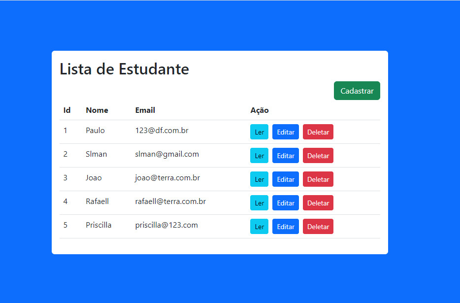
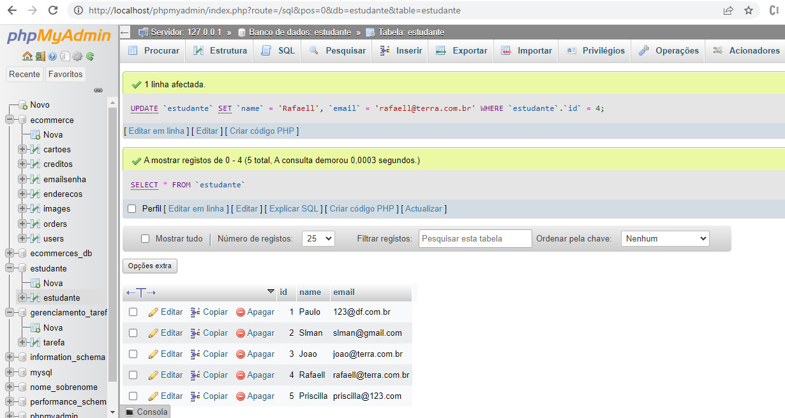

# Projeto desenvolvido com

# React-JS--Crud-Mysql

Este Projeto onde é possivel listar, visualizar, criar, editar, excluir estudantes.

 

  

  

## Site do Projeto

https://lista-de-estudante-react-php.vercel.app/

## Repositorio do Projeto

https://github.com/JacquelineCasali/lista-de-estudante-react-php

## Instalação

## FRONTEND

1. `$ cd frontEnd`
2. `$ npm install`
3. `$ npm run dev`

## BackEnd

Change your mySQL database data `server/app.js`
`$ cd server`
`$ npm install`
`$ npm start`

## BackEnd

- Cria estudante no banco de dados
- Ler estudante no banco de dados
- Atualizar estudante no banco de dados
- Excluir estudante no banco de dados
- Clique no cartão para editar e excluir

## Bibliotecas Usadas

### Front-end

- `React.js /vite`
- `Axios`

### Back-end

- `express`
- `mysql`
- `nodemon`
- `cors`
